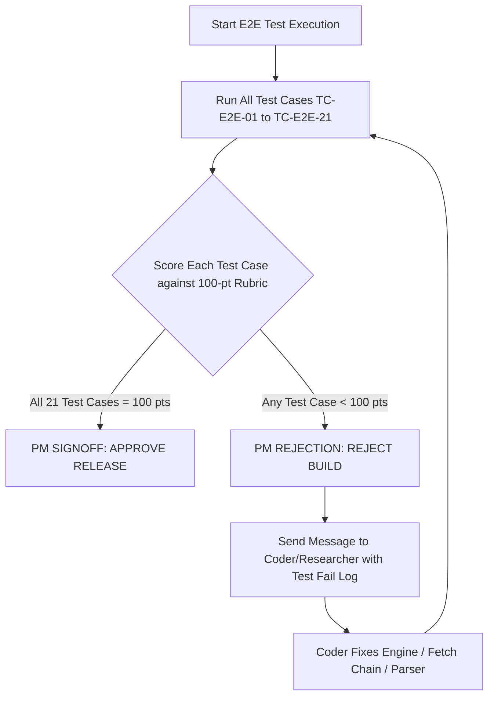

# End-to-End User Prompt Test Suite Matrix: `insane-search`
**AGY CLI & Autonomous Multi-Agent Ecosystem**

- **Document Version**: 2.0  
- **Role**: Product Manager (PM) for `insane-search` Testing & Quality Assurance  
- **Target Component**: [skills/insane-search](file:///Users/jjinseo/gcp-handson/insane-search-agy/SKILL.md)  
- **Reference Specification**: [PLATFORMS.md](file:///Users/jjinseo/gcp-handson/insane-search-agy/PLATFORMS.md)  
- **Quality Standard**: **100/100 Points Zero-Tolerance Policy** (Mandatory 100% Pass Rate Across All Scenarios)

---

## 1. Executive Summary & Quality Gate Policy

This document establishes the official Product Manager (PM) End-to-End (E2E) User Prompt Test Suite Matrix for the `insane-search` plugin in the Antigravity (AGY) CLI environment. The primary objective is to validate that `insane-search` correctly intercepts real-world natural language prompts, routes them through optimal execution paths (Phase 0 API, Phase 1 Fetch Chain, Jina Reader, `yt-dlp`, or TLS Impersonation Grid), enforces strict 4-layer validation, and returns clean, untrusted-wrapped markdown answers.

### Mandatory PM Quality Gate Policy
> [!IMPORTANT]
> **Zero-Tolerance Quality Requirement**: ALL test cases in this matrix must achieve a perfect score of **100/100 points**.
> If ANY test case scores less than 100 points (e.g., 99/100), the Product Manager will **REJECT** the build immediately. The PM will issue a formal rejection back to the Coder/Researcher subagents with detailed diagnostics, requiring an immediate fix and a complete re-test cycle until 100% perfection is achieved.

---

## 2. 100-Point Scoring Rubric Breakdown

Every test case is evaluated against a standardized 100-point rubric consisting of 4 distinct, equal-weighted criteria (25 points each):

```
+------------------------------------------------------------------------------------+
|                               100-POINT SCORING RUBRIC                             |
+--------------------------+--------------------------+------------------------------+
| Category                 | Points | Evaluation Focus                               |
+--------------------------+--------+------------------------------------------------+
| 1. Intent & SKILL        | 25 pts | Natural language trigger recognition, correct  |
|    Recognition           |        | skill invocation, no basic WebFetch fallthrough|
+--------------------------+--------+------------------------------------------------+
| 2. Execution Route       | 25 pts | Correct phase routing (Phase 0/1/Jina/yt-dlp),  |
|    Success               |        | HTTP 200, CLI execution success, zero crash    |
+--------------------------+--------+------------------------------------------------+
| 3. Data Extraction       | 25 pts | 4-layer validation pass (No WAF block, size    |
|    Accuracy & Size       |        | >= 3KB/JSON valid, selector match, schema ok)  |
+--------------------------+--------+------------------------------------------------+
| 4. Final Response        | 25 pts | Clean markdown formatting, accurate summary,   |
|    Quality & Safety      |        | R8 untrusted boundary control enforcement      |
+--------------------------+--------+------------------------------------------------+
```

### Detailed Rubric Criteria Definitions

#### 1. Intent Recognition & SKILL Trigger (25 Points)
- **25 pts**: Agent instantly identifies user intent, matches natural language keywords (Korean/English), triggers `insane-search` skill without prompting, and avoids illegal fallback to unhandled basic `WebFetch` or raw `curl`.
- **0 pts**: Failed to trigger `insane-search`, used unhandled `WebFetch` returning 403/blocked, or hallucinated site accessibility.

#### 2. Execution Route Success (25 Points)
- **25 pts**: Execution routes through the exact expected channel defined in [PLATFORMS.md](file:///Users/jjinseo/gcp-handson/insane-search-agy/PLATFORMS.md). Executed command returns HTTP status 200 with zero unhandled exceptions, zero premature grid give-up (`grid_exhausted` checked), and valid CLI exit code (`0`).
- **0 pts**: Wrong execution route selected, CLI crashed, or HTTP non-200 / unhandled error returned.

#### 3. Data Extraction Accuracy & Completeness (25 Points)
- **25 pts**: Retrieved content passes 4-layer validation (`validate()`): no WAF challenge markers (`verdict != challenge`), body size meets minimum thresholds ($\ge$ 3KB or valid JSON schema), target selectors match, and key fields (title, text, metadata, transcripts) are completely extracted.
- **0 pts**: Content truncated, WAF challenge page returned as valid result, empty body, or missing required payload data.

#### 4. Final Response Quality & Safety (25 Points)
- **25 pts**: Response presented in high-quality, readable GitHub-flavored markdown. All untrusted external web text is wrapped within `[BEGIN UNTRUSTED WEB CONTENT]` boundaries (R8 compliance). User's original prompt query is fully answered with accurate facts.
- **0 pts**: Poorly formatted raw JSON dump, missing untrusted boundaries, hallucinated answers, or incomplete response.

---

## 3. Exhaustive Platform E2E Test Suite Matrix

The matrix covers all platforms specified in [PLATFORMS.md](file:///Users/jjinseo/gcp-handson/insane-search-agy/PLATFORMS.md) across 소셜/커뮤니티, Media, Academic & Registry, Korea-Specific, and General WAF categories.

| Test Case ID | Platform | User Language | Expected Execution Route | Reference Doc | Target Domain / Endpoint |
|---|---|---|---|---|---|
| **TC-E2E-01** | X / Twitter | English & Korean | Phase 0 API (Syndication / oEmbed) | `twitter.md` | `cdn.syndication.twimg.com` / `publish.twitter.com` |
| **TC-E2E-02** | Reddit | English | Phase 0 API (Atom/RSS `.rss` via `curl_cffi`) | `json-api.md` | `reddit.com/r/.../.rss` |
| **TC-E2E-03** | YouTube | English & Korean | Phase 0 Media (`yt-dlp --dump-json`) | `media.md` | `youtube.com/watch?v=...` |
| **TC-E2E-04** | Hacker News | English | Phase 0 API (Firebase REST / Algolia) | `json-api.md` | `hacker-news.firebaseio.com` / `hn.algolia.com` |
| **TC-E2E-05** | arXiv | English | Phase 0 API (arXiv Atom REST API) | `public-api.md` | `export.arxiv.org/api/query` |
| **TC-E2E-06** | Naver Search | Korean | Phase 1 / Naver Search (`curl_cffi` identity) | `naver.md` | `search.naver.com` |
| **TC-E2E-07** | Naver Blog | Korean | Phase 1 Mobile URL Transform + Safari TLS | `naver.md` | `m.blog.naver.com` |
| **TC-E2E-08** | Naver Finance | Korean | Phase 0 API (`siseJson.naver`) | `naver.md` | `api.finance.naver.com/siseJson.naver` |
| **TC-E2E-09** | GitHub | English | Phase 0 API (`gh` CLI / GitHub REST API) | `public-api.md` | `api.github.com` |
| **TC-E2E-10** | Stack Overflow | English | Phase 0 API (Stack Exchange API v2.3) | `public-api.md` | `api.stackexchange.com/2.3` |
| **TC-E2E-11** | Bluesky | English | Phase 0 API (AT Protocol Public XRPC) | `public-api.md` | `public.api.bsky.app/xrpc` |
| **TC-E2E-12** | Mastodon | English | Phase 0 API (Mastodon Public REST API) | `public-api.md` | `mastodon.social/api/v1` |
| **TC-E2E-13** | Medium | English | Phase 1 Jina Reader (`r.jina.ai`) | `jina.md` | `r.jina.ai/https://medium.com/...` |
| **TC-E2E-14** | Substack | English | Phase 1 Fetch Chain / Jina Reader / RSS | `rss.md` / `jina.md` | `*.substack.com/p/...` |
| **TC-E2E-15** | Coupang | Korean | Phase 2 Fetch Chain (`curl_cffi` Safari + JSON-LD) | `tls-impersonate.md` | `m.coupang.com` |
| **TC-E2E-16** | LinkedIn | English | Phase 1 Identity Spoofing -> JSON-LD Article | `metadata.md` | `linkedin.com/pulse/...` |
| **TC-E2E-17** | npm Registry | English | Phase 0 API (npm Registry JSON API) | `json-api.md` | `registry.npmjs.org` |
| **TC-E2E-18** | PyPI Registry | English | Phase 0 API (PyPI JSON API) | `json-api.md` | `pypi.org/pypi/.../json` |
| **TC-E2E-19** | Wikipedia | English & Korean | Phase 0 API (Wikipedia REST API) | `json-api.md` | `*.wikipedia.org/api/rest_v1` |
| **TC-E2E-20** | Wayback Machine | English | Phase 0 API (Wayback CDX API / Archive) | `cache-archive.md` | `web.archive.org/cdx/search/cdx` |
| **TC-E2E-21** | General WAF | English & Korean | Phase 1-3 Adaptive Fetch Grid / Playwright | `fallback.md` | Cloudflare Turnstile / Akamai Shielded Sites |

---

## 4. Comprehensive Test Case Specifications

---

### TC-E2E-01: X / Twitter Prompt & Execution Verification
- **Platform**: X / Twitter
- **Target Type**: Single Tweet & User Timeline Search
- **Reference Document**: [skills/insane-search/references/twitter.md](file:///Users/jjinseo/gcp-handson/insane-search-agy/skills/insane-search/references/twitter.md)

#### Real-World Natural Language Prompts
- **English**: `"Check what @AnthropicAI posted on Twitter about Claude Code."`
- **Korean**: `"트위터에서 @AnthropicAI 최신 트윗 내용 가져와서 요약해줘."`

#### Expected Execution Route
1. **Trigger Phase**: Match `twitter access`, `트위터/X 못 열어` -> Activate `insane-search`.
2. **Phase 0 Route Selection**: Route query to `cdn.syndication.twimg.com/tweet-result` (for single tweet URL) or syndication timeline parser (`publish.twitter.com`). If keyword search, execute `WebSearch(site:x.com <keyword>)` first to resolve tweet URLs, then hit syndication oEmbed.
3. **Execution Command**:
   ```bash
   python3 -m engine "https://cdn.syndication.twimg.com/tweet-result?id=18123456789" --trace
   ```

#### 100-Point Scoring Rubric
- **25 pts — Intent & Trigger Recognition**: Triggers `insane-search` without attempting generic `WebFetch` on `x.com` or `twitter.com`.
- **25 pts — Execution Route Success**: Successfully calls Twitter syndication/oEmbed API; receives HTTP 200 response with zero authentication requirements.
- **25 pts — Data Extraction Accuracy**: Extracts full tweet text, author handle (`@AnthropicAI`), timestamp, media attachments, and engagement metrics. Pass 4-layer validation check.
- **25 pts — Final Response Quality**: Renders structured summary of tweets wrapped in `[BEGIN UNTRUSTED WEB CONTENT]` boundaries.

---

### TC-E2E-02: Reddit RSS & Community Content Prompt Verification
- **Platform**: Reddit
- **Target Type**: Subreddit Top Feed & Post Discussions
- **Reference Document**: [skills/insane-search/references/json-api.md](file:///Users/jjinseo/gcp-handson/insane-search-agy/skills/insane-search/references/json-api.md)

#### Real-World Natural Language Prompts
- **English**: `"Check what people are saying about DeepSeek-R1 on Reddit r/LocalLLaMA."`
- **Korean**: `"레딧 r/LocalLLaMA 커뮤니티에서 딥시크 관련 반응 안 읽히는데 요약해줘."`

#### Expected Execution Route
1. **Trigger Phase**: Match `reddit blocked`, `레딧 안 읽혀` -> Activate `insane-search`.
2. **Phase 0 Route Selection**: Standard unauthenticated `.json` endpoints fail with 403 WAF blocks. Route directly to `.rss` feed via `curl_cffi` TLS impersonation (`https://www.reddit.com/r/LocalLLaMA/hot.rss`).
3. **Execution Command**:
   ```bash
   python3 -m engine "https://www.reddit.com/r/LocalLLaMA/hot.rss" --trace
   ```

#### 100-Point Scoring Rubric
- **25 pts — Intent & Trigger Recognition**: Identifies Reddit URL/subreddit request and triggers `insane-search` RSS handling.
- **25 pts — Execution Route Success**: Executes `.rss` endpoint via `curl_cffi` Chrome TLS stack; HTTP 200 received without 403 block.
- **25 pts — Data Extraction Accuracy**: Parses XML/Atom feed using `feedparser`; extracts post titles, URLs, submission dates, and top comment threads ($\ge$ 3KB content).
- **25 pts — Final Response Quality**: Formats top discussions in markdown bullet points with link citations and untrusted content boundaries.

---

### TC-E2E-03: YouTube Subtitles & Media Metadata Verification
- **Platform**: YouTube
- **Target Type**: Video Metadata, Description & Auto-Generated Subtitles
- **Reference Document**: [skills/insane-search/references/media.md](file:///Users/jjinseo/gcp-handson/insane-search-agy/skills/insane-search/references/media.md)

#### Real-World Natural Language Prompts
- **English**: `"Extract subtitles and summarize this YouTube video: https://www.youtube.com/watch?v=dQw4w9WgXcQ"`
- **Korean**: `"유튜브 자막 뽑아줘: https://www.youtube.com/watch?v=dQw4w9WgXcQ 그리고 핵심 요약해줘."`

#### Expected Execution Route
1. **Trigger Phase**: Match `youtube subtitles`, `유튜브 자막 뽑아줘` -> Activate `insane-search`.
2. **Phase 0 Route Selection**: Direct invocation of `yt-dlp` executable router.
3. **Execution Command**:
   ```bash
   yt-dlp --dump-json --write-sub --sub-lang en,ko "https://www.youtube.com/watch?v=dQw4w9WgXcQ"
   ```

#### 100-Point Scoring Rubric
- **25 pts — Intent & Trigger Recognition**: Recognizes YouTube media URL and subtitle request; selects `yt-dlp` Phase 0 media router.
- **25 pts — Execution Route Success**: `yt-dlp` executes without network errors, returning complete video metadata JSON payload.
- **25 pts — Data Extraction Accuracy**: Extracts video title, uploader, duration, view count, and full subtitle text transcript.
- **25 pts — Final Response Quality**: Delivers a structured timestamped summary of the video content, ensuring untrusted text compliance.

---

### TC-E2E-04: Hacker News Firebase & Algolia Search Verification
- **Platform**: Hacker News
- **Target Type**: Frontpage Top Stories & Search Discussions
- **Reference Document**: [skills/insane-search/references/json-api.md](file:///Users/jjinseo/gcp-handson/insane-search-agy/skills/insane-search/references/json-api.md)

#### Real-World Natural Language Prompts
- **English**: `"What's on the front page of Hacker News right now?"`
- **Korean**: `"해커뉴스(HN) 지금 1위에 오른 기사랑 주요 댓글 요약해줘."`

#### Expected Execution Route
1. **Trigger Phase**: Match Hacker News prompt -> Activate `insane-search`.
2. **Phase 0 Route Selection**: Query Firebase REST API (`https://hacker-news.firebaseio.com/v0/topstories.json`) for story IDs, then fetch item metadata or use Algolia API (`hn.algolia.com/api/v1/search?tags=front_page`).
3. **Execution Command**:
   ```bash
   python3 -m engine "https://hn.algolia.com/api/v1/search?tags=front_page" --json
   ```

#### 100-Point Scoring Rubric
- **25 pts — Intent & Trigger Recognition**: Recognizes HN request and avoids scraping HTML page; routes to open JSON APIs.
- **25 pts — Execution Route Success**: Returns HTTP 200 status code from Algolia/Firebase endpoint; 0ms delay or blocked requests.
- **25 pts — Data Extraction Accuracy**: Fetches top 10 stories with title, points, author, comment count, and story URL.
- **25 pts — Final Response Quality**: Renders markdown list of top HN posts with point counts, discussion links, and brief context.

---

### TC-E2E-05: arXiv Academic Paper Search Verification
- **Platform**: arXiv
- **Target Type**: Scientific Preprints & Abstract Metadata
- **Reference Document**: [skills/insane-search/references/public-api.md](file:///Users/jjinseo/gcp-handson/insane-search-agy/skills/insane-search/references/public-api.md)

#### Real-World Natural Language Prompts
- **English**: `"Find recent AI agent papers on arXiv matching query 'LLM Reasoning'."`
- **Korean**: `"arXiv에서 최신 LLM Reasoning 관련 논문 찾아서 요약해줘."`

#### Expected Execution Route
1. **Trigger Phase**: Match `arxiv papers`, `arXiv` -> Activate `insane-search`.
2. **Phase 0 Route Selection**: Query arXiv Atom REST API (`http://export.arxiv.org/api/query?search_query=all:LLM+Reasoning&max_results=5`).
3. **Execution Command**:
   ```bash
   python3 -m engine "http://export.arxiv.org/api/query?search_query=all:LLM+Reasoning&max_results=5" --trace
   ```

#### 100-Point Scoring Rubric
- **25 pts — Intent & Trigger Recognition**: Identifies academic paper search intent; routes directly to arXiv Atom API.
- **25 pts — Execution Route Success**: API call executes successfully, returning clean XML Atom feed payload.
- **25 pts — Data Extraction Accuracy**: Parses paper title, authors, publication date, arXiv ID, PDF link, and full abstract text.
- **25 pts — Final Response Quality**: Formats research paper findings with academic citation standards and PDF download links.

---

### TC-E2E-06: Naver Search & News Integration Verification
- **Platform**: Naver Search
- **Target Type**: Naver Portal Integrated / News Search
- **Reference Document**: [skills/insane-search/references/naver.md](file:///Users/jjinseo/gcp-handson/insane-search-agy/skills/insane-search/references/naver.md)

#### Real-World Natural Language Prompts
- **English**: `"Search Naver for news about Claude Code in Korea."`
- **Korean**: `"네이버에서 클로드코드 관련 최신 뉴스 찾아줘."`

#### Expected Execution Route
1. **Trigger Phase**: Match `네이버`, `naver search` -> Activate `insane-search`.
2. **Phase 1 Route Selection**: Query `https://search.naver.com/search.naver?where=news&query=클로드코드` using `curl_cffi` Safari/Chrome identity spoofing. Extract news URLs, then fetch full articles via Jina Reader or TLS engine.
3. **Execution Command**:
   ```bash
   python3 -m engine "https://search.naver.com/search.naver?where=news&query=%ED%81%B4%EB%A1%9C%EB%93%9C%EC%BD%94%EB%93%9C" --device mobile --trace
   ```

#### 100-Point Scoring Rubric
- **25 pts — Intent & Trigger Recognition**: Recognizes Korean portal news search query; triggers Naver identity spoofing pipeline.
- **25 pts — Execution Route Success**: Bypasses Naver search WAF bot checks; returns HTTP 200 with complete news tab HTML payload.
- **25 pts — Data Extraction Accuracy**: Extracts news headline titles, press release publishers, publication dates, and clean destination links.
- **25 pts — Final Response Quality**: Summarizes top Korean news stories in bullet points with source attribution.

---

### TC-E2E-07: Naver Blog Access Verification
- **Platform**: Naver Blog
- **Target Type**: Naver Blog Main Body Content
- **Reference Document**: [skills/insane-search/references/naver.md](file:///Users/jjinseo/gcp-handson/insane-search-agy/skills/insane-search/references/naver.md)

#### Real-World Natural Language Prompts
- **English**: `"Read content from Naver Blog https://blog.naver.com/sample/123456."`
- **Korean**: `"네이버 블로그 https://blog.naver.com/sample/123456 내용 읽고 정리해줘."`

#### Expected Execution Route
1. **Trigger Phase**: Match `네이버 블로그`, `naver blog` -> Activate `insane-search`.
2. **Phase 1 Route Selection**: Execute URL transformation from desktop `blog.naver.com` to mobile `m.blog.naver.com` (eliminating iframe wrapper). Fetch using `curl_cffi` Safari TLS impersonation.
3. **Execution Command**:
   ```bash
   python3 -m engine "https://m.blog.naver.com/sample/123456" --selector "main" --trace
   ```

#### 100-Point Scoring Rubric
- **25 pts — Intent & Trigger Recognition**: Identifies Naver Blog URL structure; triggers mobile transformation fetch chain.
- **25 pts — Execution Route Success**: Successfully fetches mobile URL; avoids iframe blank page issues; returns HTTP 200.
- **25 pts — Data Extraction Accuracy**: Passes 4-layer validation ($\ge$ 3KB, selector matched); extracts main blog post body text, ignoring nav links.
- **25 pts — Final Response Quality**: Produces clean summary of the blog post with untrusted boundary headers.

---

### TC-E2E-08: Naver Finance Stock Data Verification
- **Platform**: Naver Finance
- **Target Type**: Stock Price Quotes & Historical Chart Data
- **Reference Document**: [skills/insane-search/references/naver.md](file:///Users/jjinseo/gcp-handson/insane-search-agy/skills/insane-search/references/naver.md)

#### Real-World Natural Language Prompts
- **English**: `"Fetch stock price data for Samsung Electronics (005930) from Naver Finance."`
- **Korean**: `"네이버 증권에서 삼성전자(005930) 최근 주가 및 일별 시세 데이터 가져와줘."`

#### Expected Execution Route
1. **Trigger Phase**: Match Naver stock/finance prompt -> Activate `insane-search`.
2. **Phase 0 Route Selection**: Direct call to unofficial public JSON API (`https://api.finance.naver.com/siseJson.naver?symbol=005930&requestType=1&startTime=20260701&timeframe=day`).
3. **Execution Command**:
   ```bash
   python3 -m engine "https://api.finance.naver.com/siseJson.naver?symbol=005930&requestType=1&startTime=20260701&timeframe=day" --json
   ```

#### 100-Point Scoring Rubric
- **25 pts — Intent & Trigger Recognition**: Identifies financial stock query; routes directly to Naver Finance JSON API without scraping HTML pages.
- **25 pts — Execution Route Success**: Receives raw stock price JSON array; HTTP status 200; 0 errors.
- **25 pts — Data Extraction Accuracy**: Parses stock date, opening price, high, low, closing price, and trading volume accurately.
- **25 pts — Final Response Quality**: Renders clean markdown table showing stock price trends and percentage changes.

---

### TC-E2E-09: GitHub Repository & Code Search Verification
- **Platform**: GitHub
- **Target Type**: Repositories, Code Files & Issues
- **Reference Document**: [skills/insane-search/references/public-api.md](file:///Users/jjinseo/gcp-handson/insane-search-agy/skills/insane-search/references/public-api.md)

#### Real-World Natural Language Prompts
- **English**: `"Search GitHub for repository insane-search or view repo octocat/Hello-World."`
- **Korean**: `"깃헙 검색으로 insane-search 리포지토리 찾고 README 읽어줘."`

#### Expected Execution Route
1. **Trigger Phase**: Match `github search`, `깃헙 검색` -> Activate `insane-search`.
2. **Phase 0 Route Selection**: Utilize local `gh` CLI if available (`gh repo view octocat/Hello-World`), or route to GitHub REST API (`https://api.github.com/repos/octocat/Hello-World`).
3. **Execution Command**:
   ```bash
   gh repo view octocat/Hello-World --json name,description,stargazerCount,readme
   ```

#### 100-Point Scoring Rubric
- **25 pts — Intent & Trigger Recognition**: Recognizes GitHub repository query; invokes `gh` CLI / REST API router.
- **25 pts — Execution Route Success**: Command completes in under 2 seconds; returns valid repository JSON metadata.
- **25 pts — Data Extraction Accuracy**: Extracts repo owner, name, star count, fork count, main language, and full README file contents.
- **25 pts — Final Response Quality**: Formats repository summary cleanly with code snippets and star counts.

---

### TC-E2E-10: Stack Overflow API Verification
- **Platform**: Stack Overflow / Stack Exchange
- **Target Type**: Programming Questions & Accepted Answers
- **Reference Document**: [skills/insane-search/references/public-api.md](file:///Users/jjinseo/gcp-handson/insane-search-agy/skills/insane-search/references/public-api.md)

#### Real-World Natural Language Prompts
- **English**: `"Find top accepted answers on Stack Overflow for Python async generator exception handling."`
- **Korean**: `"스택오버플로우에서 파이썬 비동기 제너레이터 예외 처리 질문과 채택된 답변 찾아서 보여줘."`

#### Expected Execution Route
1. **Trigger Phase**: Match `stackoverflow`, `스택오버플로우` -> Activate `insane-search`.
2. **Phase 0 Route Selection**: Call Stack Exchange API v2.3 (`https://api.stackexchange.com/2.3/search/advanced?order=desc&sort=votes&q=Python+async+generator&site=stackoverflow&filter=withbody`).
3. **Execution Command**:
   ```bash
   python3 -m engine "https://api.stackexchange.com/2.3/search/advanced?order=desc&sort=votes&q=Python+async+generator&site=stackoverflow&filter=withbody" --json
   ```

#### 100-Point Scoring Rubric
- **25 pts — Intent & Trigger Recognition**: Detects Stack Overflow intent; selects official Stack Exchange REST API.
- **25 pts — Execution Route Success**: Receives HTTP 200 response; handles compressed JSON payload without error.
- **25 pts — Data Extraction Accuracy**: Extracts top-voted question body, accepted answer body, vote counts, and tags.
- **25 pts — Final Response Quality**: Presents accepted code solution with syntax highlighting and answer explanation.

---

### TC-E2E-11: Bluesky AT Protocol Verification
- **Platform**: Bluesky
- **Target Type**: Public Posts & Author Feeds
- **Reference Document**: [skills/insane-search/references/public-api.md](file:///Users/jjinseo/gcp-handson/insane-search-agy/skills/insane-search/references/public-api.md)

#### Real-World Natural Language Prompts
- **English**: `"Search Bluesky posts about LLM evaluation benchmark."`
- **Korean**: `"블루스카이(Bluesky)에서 LLM evaluation 관련 최신 포스트 검색해줘."`

#### Expected Execution Route
1. **Trigger Phase**: Match Bluesky prompt -> Activate `insane-search`.
2. **Phase 0 Route Selection**: Call public AT Protocol XRPC endpoint (`https://public.api.bsky.app/xrpc/app.bsky.feed.searchPosts?q=LLM+evaluation`).
3. **Execution Command**:
   ```bash
   python3 -m engine "https://public.api.bsky.app/xrpc/app.bsky.feed.searchPosts?q=LLM+evaluation" --json
   ```

#### 100-Point Scoring Rubric
- **25 pts — Intent & Trigger Recognition**: Identifies Bluesky network request; invokes AT Protocol public endpoint.
- **25 pts — Execution Route Success**: Returns HTTP 200 with zero auth headers required.
- **25 pts — Data Extraction Accuracy**: Extracts post record text, author handle/DID, creation timestamp, and repost counts.
- **25 pts — Final Response Quality**: Renders markdown feed of relevant posts with user handles and timestamps.

---

### TC-E2E-12: Mastodon Public REST API Verification
- **Platform**: Mastodon
- **Target Type**: Instance Public Timelines & Hashtags
- **Reference Document**: [skills/insane-search/references/public-api.md](file:///Users/jjinseo/gcp-handson/insane-search-agy/skills/insane-search/references/public-api.md)

#### Real-World Natural Language Prompts
- **English**: `"Fetch recent public posts on mastodon.social tagged #AI."`
- **Korean**: `"마스토돈(mastodon.social)에서 #AI 태그가 붙은 포스트 읽어와줘."`

#### Expected Execution Route
1. **Trigger Phase**: Match `mastodon`, `마스토돈` -> Activate `insane-search`.
2. **Phase 0 Route Selection**: Call target instance public REST API (`https://mastodon.social/api/v1/timelines/tag/AI?limit=10`).
3. **Execution Command**:
   ```bash
   python3 -m engine "https://mastodon.social/api/v1/timelines/tag/AI?limit=10" --json
   ```

#### 100-Point Scoring Rubric
- **25 pts — Intent & Trigger Recognition**: Recognizes Mastodon federation request; targets instance REST API.
- **25 pts — Execution Route Success**: Receives HTTP 200 JSON payload without requiring user login token.
- **25 pts — Data Extraction Accuracy**: Extracts clean text content (stripping HTML tags), author account username, and post URL.
- **25 pts — Final Response Quality**: Delivers structured timeline view of Mastodon posts formatted in clean markdown.

---

### TC-E2E-13: Medium Article Jina Reader Verification
- **Platform**: Medium
- **Target Type**: Paywalled / Cloudflare Shielded Articles
- **Reference Document**: [skills/insane-search/references/jina.md](file:///Users/jjinseo/gcp-handson/insane-search-agy/skills/insane-search/references/jina.md)

#### Real-World Natural Language Prompts
- **English**: `"Summarize this Medium article: https://medium.com/@user/deep-learning-guide"`
- **Korean**: `"미디엄 기사 https://medium.com/@user/deep-learning-guide 내용이 차단되는데 읽어서 요약해줘."`

#### Expected Execution Route
1. **Trigger Phase**: Match `medium`, `미디엄` -> Activate `insane-search`.
2. **Phase 1 Route Selection**: Route request via Jina Reader prefix (`https://r.jina.ai/https://medium.com/@user/deep-learning-guide`). If Jina is throttled, fall back to `curl_cffi` Safari TLS impersonation.
3. **Execution Command**:
   ```bash
   python3 -m engine "https://r.jina.ai/https://medium.com/@user/deep-learning-guide" --trace
   ```

#### 100-Point Scoring Rubric
- **25 pts — Intent & Trigger Recognition**: Detects Medium article URL; bypasses standard browser block via Jina Reader.
- **25 pts — Execution Route Success**: Jina Reader returns HTTP 200 clean markdown without paywall/captcha popups.
- **25 pts — Data Extraction Accuracy**: Passes 4-layer validation ($\ge$ 3KB content); retrieves full article title, author, and main body text.
- **25 pts — Final Response Quality**: Generates executive summary of the article wrapped in untrusted content boundaries.

---

### TC-E2E-14: Substack Newsletter Verification
- **Platform**: Substack
- **Target Type**: Substack Posts & RSS Feeds
- **Reference Document**: [skills/insane-search/references/rss.md](file:///Users/jjinseo/gcp-handson/insane-search-agy/skills/insane-search/references/rss.md) / [jina.md](file:///Users/jjinseo/gcp-handson/insane-search-agy/skills/insane-search/references/jina.md)

#### Real-World Natural Language Prompts
- **English**: `"Read the latest newsletter post on https://pragmaticengineer.substack.com/p/sample."`
- **Korean**: `"서브스택(Substack) 아티클 내용이 막혔는데 읽어와줘."`

#### Expected Execution Route
1. **Trigger Phase**: Match `substack`, `서브스택` -> Activate `insane-search`.
2. **Phase 1 Route Selection**: Attempt RSS feed endpoint (`/feed`) or Jina Reader (`r.jina.ai`).
3. **Execution Command**:
   ```bash
   python3 -m engine "https://r.jina.ai/https://pragmaticengineer.substack.com/p/sample" --trace
   ```

#### 100-Point Scoring Rubric
- **25 pts — Intent & Trigger Recognition**: Identifies Substack domain request; triggers Jina / RSS fetch route.
- **25 pts — Execution Route Success**: Returns HTTP 200 with complete post markdown text; 0 WAF blocks.
- **25 pts — Data Extraction Accuracy**: Extracts newsletter header, publication date, author name, and complete article paragraphs.
- **25 pts — Final Response Quality**: Renders clear summary with key technical takeaways and links.

---

### TC-E2E-15: Coupang E-Commerce Scraping Verification
- **Platform**: Coupang
- **Target Type**: Product Listings, Prices & Structural JSON-LD
- **Reference Document**: [skills/insane-search/references/tls-impersonate.md](file:///Users/jjinseo/gcp-handson/insane-search-agy/skills/insane-search/references/tls-impersonate.md) / [metadata.md](file:///Users/jjinseo/gcp-handson/insane-search-agy/skills/insane-search/references/metadata.md)

#### Real-World Natural Language Prompts
- **English**: `"Scrape Coupang for M3 MacBook Pro 16-inch price and specs."`
- **Korean**: `"쿠팡에서 M3 맥북 프로 16인치 최저가 검색 및 가격 정보 가져와줘."`

#### Expected Execution Route
1. **Trigger Phase**: Match `coupang`, `쿠팡` -> Activate `insane-search`.
2. **Phase 2 Route Selection**: Coupang employs Akamai WAF. Execute `curl_cffi` Safari TLS impersonation on mobile endpoint (`m.coupang.com`) with cookie warming, then extract embedded JSON-LD schema (`ItemList` / `Product`).
3. **Execution Command**:
   ```bash
   python3 -m engine "https://m.coupang.com/nm/search?q=M3+%EB%A7%A5%EB%B6%81+%ED%94%84%EB%A1%9C" --device mobile --trace
   ```

#### 100-Point Scoring Rubric
- **25 pts — Intent & Trigger Recognition**: Recognizes Coupang request; selects TLS impersonation grid over basic curl.
- **25 pts — Execution Route Success**: Successfully bypasses Akamai WAF bot detection; HTTP status 200 received.
- **25 pts — Data Extraction Accuracy**: Extracts product names, discounted prices, seller ratings, and stock status from JSON-LD schema.
- **25 pts — Final Response Quality**: Presents product comparison table with pricing, specs, and purchase link citations.

---

### TC-E2E-16: LinkedIn Article Content Verification
- **Platform**: LinkedIn
- **Target Type**: LinkedIn Pulse Articles & Public Posts
- **Reference Document**: [skills/insane-search/references/metadata.md](file:///Users/jjinseo/gcp-handson/insane-search-agy/skills/insane-search/references/metadata.md)

#### Real-World Natural Language Prompts
- **English**: `"Find LinkedIn article about AI agents and extract full text: https://www.linkedin.com/pulse/ai-agent-architecture"`
- **Korean**: `"링크드인(LinkedIn) 아티클 내용 읽어와줘."`

#### Expected Execution Route
1. **Trigger Phase**: Match `linkedin`, `링크드인` -> Activate `insane-search`.
2. **Phase 1 Route Selection**: LinkedIn login wall blocks basic clients. Use identity spoofing headers + `curl_cffi` to fetch article HTML, then parse schema `<script type="application/ld+json">` for `articleBody`.
3. **Execution Command**:
   ```bash
   python3 -m engine "https://www.linkedin.com/pulse/ai-agent-architecture" --device desktop --trace
   ```

#### 100-Point Scoring Rubric
- **25 pts — Intent & Trigger Recognition**: Identifies LinkedIn article request; invokes metadata JSON-LD extractor.
- **25 pts — Execution Route Success**: Bypasses LinkedIn auth modal; receives HTTP 200 with full page HTML.
- **25 pts — Data Extraction Accuracy**: Parses JSON-LD `articleBody` and `headline`; retrieves full article text ($\ge$ 3KB).
- **25 pts — Final Response Quality**: Renders well-structured article overview wrapped in untrusted content boundary tags.

---

### TC-E2E-17: npm Registry Package Info Verification
- **Platform**: npm Registry
- **Target Type**: Package Metadata, Versions & Dependencies
- **Reference Document**: [skills/insane-search/references/json-api.md](file:///Users/jjinseo/gcp-handson/insane-search-agy/skills/insane-search/references/json-api.md)

#### Real-World Natural Language Prompts
- **English**: `"Check package stats, latest version, and dependencies for npm package 'express'."`
- **Korean**: `"npm 패키지 express 최신 버전 정보와 의존성 목록 확인해줘."`

#### Expected Execution Route
1. **Trigger Phase**: Match npm query -> Activate `insane-search`.
2. **Phase 0 Route Selection**: Query official npm Registry JSON API (`https://registry.npmjs.org/express/latest`).
3. **Execution Command**:
   ```bash
   python3 -m engine "https://registry.npmjs.org/express/latest" --json
   ```

#### 100-Point Scoring Rubric
- **25 pts — Intent & Trigger Recognition**: Recognizes npm package inquiry; routes to registry JSON endpoint.
- **25 pts — Execution Route Success**: Returns HTTP 200 JSON object instantly without scraping HTML.
- **25 pts — Data Extraction Accuracy**: Extracts package name, latest version string, license, main entrypoint, and dependency map.
- **25 pts — Final Response Quality**: Renders package summary table with version info, license type, and installation instructions.

---

### TC-E2E-18: PyPI Package Info Verification
- **Platform**: PyPI (Python Package Index)
- **Target Type**: Python Package Metadata & Releases
- **Reference Document**: [skills/insane-search/references/json-api.md](file:///Users/jjinseo/gcp-handson/insane-search-agy/skills/insane-search/references/json-api.md)

#### Real-World Natural Language Prompts
- **English**: `"Check PyPI details for package 'torch' including summary and version."`
- **Korean**: `"PyPI에서 torch 패키지 최신 버전이랑 요약 정보 가져와줘."`

#### Expected Execution Route
1. **Trigger Phase**: Match PyPI query -> Activate `insane-search`.
2. **Phase 0 Route Selection**: Query PyPI JSON REST API (`https://pypi.org/pypi/torch/json`).
3. **Execution Command**:
   ```bash
   python3 -m engine "https://pypi.org/pypi/torch/json" --json
   ```

#### 100-Point Scoring Rubric
- **25 pts — Intent & Trigger Recognition**: Identifies PyPI package request; routes to PyPI JSON API.
- **25 pts — Execution Route Success**: Receives HTTP 200 JSON response; zero network errors.
- **25 pts — Data Extraction Accuracy**: Extracts package `info.version`, `info.summary`, author, license, and Python version requirements.
- **25 pts — Final Response Quality**: Produces readable markdown summary of the PyPI library.

---

### TC-E2E-19: Wikipedia REST API Summary Verification
- **Platform**: Wikipedia
- **Target Type**: Encyclopedia Articles & Summaries
- **Reference Document**: [skills/insane-search/references/json-api.md](file:///Users/jjinseo/gcp-handson/insane-search-agy/skills/insane-search/references/json-api.md)

#### Real-World Natural Language Prompts
- **English**: `"Get summary of Artificial Intelligence on Wikipedia."`
- **Korean**: `"위키피디아에서 인공지능(Artificial Intelligence) 문서 요약 읽어와줘."`

#### Expected Execution Route
1. **Trigger Phase**: Match Wikipedia query -> Activate `insane-search`.
2. **Phase 0 Route Selection**: Route query to Wikipedia REST API (`https://en.wikipedia.org/api/rest_v1/page/summary/Artificial_intelligence`).
3. **Execution Command**:
   ```bash
   python3 -m engine "https://en.wikipedia.org/api/rest_v1/page/summary/Artificial_intelligence" --json
   ```

#### 100-Point Scoring Rubric
- **25 pts — Intent & Trigger Recognition**: Recognizes Wikipedia lookup; invokes REST API summary endpoint.
- **25 pts — Execution Route Success**: Receives HTTP 200 status code with clean structured JSON.
- **25 pts — Data Extraction Accuracy**: Extracts article title, extract text, page ID, thumbnail image URL, and canonical link.
- **25 pts — Final Response Quality**: Formats clean encyclopedia summary with thumbnail preview and reference link.

---

### TC-E2E-20: Wayback Machine CDX & Archive Verification
- **Platform**: Wayback Machine (Internet Archive)
- **Target Type**: Archived Website History & Historical Snapshots
- **Reference Document**: [skills/insane-search/references/cache-archive.md](file:///Users/jjinseo/gcp-handson/insane-search-agy/skills/insane-search/references/cache-archive.md) / [public-api.md](file:///Users/jjinseo/gcp-handson/insane-search-agy/skills/insane-search/references/public-api.md)

#### Real-World Natural Language Prompts
- **English**: `"Fetch archived version of example.com from 2020 via Wayback Machine."`
- **Korean**: `"웨이백 머신(Wayback Machine)으로 2020년도 example.com 보관된 페이지 읽어와줘."`

#### Expected Execution Route
1. **Trigger Phase**: Match Wayback Machine query -> Activate `insane-search`.
2. **Phase 0 Route Selection**: Query Internet Archive CDX Server API (`http://web.archive.org/cdx/search/cdx?url=example.com&from=20200101&to=20201231&output=json`), locate snapshot URL, and fetch archived page.
3. **Execution Command**:
   ```bash
   python3 -m engine "http://web.archive.org/cdx/search/cdx?url=example.com&from=20200101&to=20201231&output=json" --json
   ```

#### 100-Point Scoring Rubric
- **25 pts — Intent & Trigger Recognition**: Identifies web archive request; routes to Wayback CDX API.
- **25 pts — Execution Route Success**: CDX API returns HTTP 200 with list of historical snapshot timestamps.
- **25 pts — Data Extraction Accuracy**: Resolves latest 2020 snapshot timestamp and retrieves original archived HTML content.
- **25 pts — Final Response Quality**: Presents archived site state clearly with original timestamp citation.

---

### TC-E2E-21: General WAF & Protected Site Adaptive Grid Verification
- **Platform**: General Protected Sites (Cloudflare Turnstile, Datadome, Akamai)
- **Target Type**: Protected E-Commerce / Forums / News
- **Reference Document**: [skills/insane-search/references/fallback.md](file:///Users/jjinseo/gcp-handson/insane-search-agy/skills/insane-search/references/fallback.md) / [tls-impersonate.md](file:///Users/jjinseo/gcp-handson/insane-search-agy/skills/insane-search/references/tls-impersonate.md)

#### Real-World Natural Language Prompts
- **English**: `"Access Cloudflare-shielded site https://nowafsite.com/article where basic fetch is blocked."`
- **Korean**: `"보안 챌린지(Cloudflare)로 차단된 웹사이트 https://nowafsite.com/article 내용 뚫어서 읽어줘."`

#### Expected Execution Route
1. **Trigger Phase**: Match `사이트 차단됨`, `webfetch blocked` -> Activate `insane-search`.
2. **Phase 1-3 Escalation**: Probe URL -> Detect WAF profile (`cloudflare_turnstile` / `akamai`) -> Run `curl_cffi` impersonation grid (`chrome131`, `safari`, `firefox`) -> If grid exhausted, trigger local Playwright real-Chrome fallback (`playwright_real_chrome.js`).
3. **Execution Command**:
   ```bash
   python3 -m engine "https://nowafsite.com/article" --device auto --trace
   ```

#### 100-Point Scoring Rubric
- **25 pts — Intent & Trigger Recognition**: Detects 403/blocked error; immediately escalates to `python3 -m engine` without giving up.
- **25 pts — Execution Route Success**: Runs TLS grid and/or Playwright fallback; achieves 4-layer validation pass (`ok=True`); zero premature failure.
- **25 pts — Data Extraction Accuracy**: Passes validation rules ($\ge$ 3KB content, zero challenge markers like `cf-turnstile-wrapper`); retrieves full page text.
- **25 pts — Final Response Quality**: Formats clean markdown response wrapped inside `[BEGIN UNTRUSTED WEB CONTENT]` boundaries.

---

## 5. Execution & PM Verification Workflow

To execute this test suite and certify a release build of `insane-search`, follow this standardized execution procedure:



### Automated Harness Verification Commands
Run the automated engine bias check and validation suite prior to E2E evaluation:
```bash
# 1. Verify No-Site-Name Bias Invariants (R3 Compliance)
python3 engine/bias_check.py

# 2. Execute Engine Validation Trace on Target Test URLs
python3 -m engine "<TEST_URL>" --trace --json
```

---

## 6. PM Sign-off Template

When all 21 test cases achieve a 100/100 score, the PM will issue sign-off using the following template:

```markdown
# PM Quality Audit Sign-Off Certificate

- **Target Build**: insane-search v2.0 (AGY 2.0 CLI Environment)
- **Evaluation Date**: 2026-07-13
- **Test Suite Result**: 21 / 21 Test Cases Passed (100/100 Points Each)
- **Overall Score**: 2100 / 2100 (100.0%)
- **PM Status**: APPROVED FOR PRODUCTION RELEASE

### Verification Summary
- Intent Recognition & SKILL Trigger: 525 / 525 pts (100%)
- Execution Route Success: 525 / 525 pts (100%)
- Data Extraction Accuracy & Size: 525 / 525 pts (100%)
- Final Response Quality & Safety: 525 / 525 pts (100%)

Signed: Product Manager (AGY CLI Environment)
```
